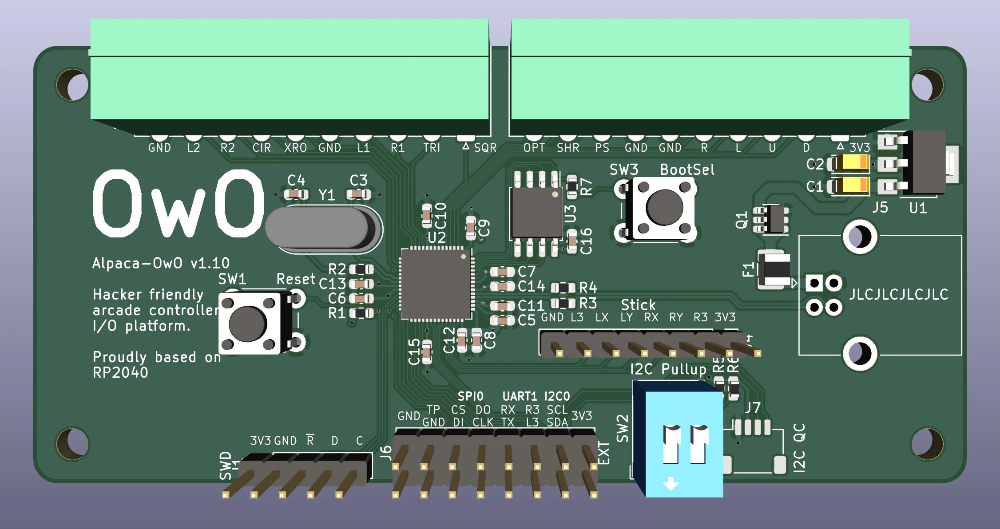

# Alpaca-OwO

Obtainable w/ rOna I/O board.

## Features

- Familiar form factor
- Removable screw terminals makes reconnecting buttons more convenient
  - Tool-less spring terminal option available (when using Phoenix 1952348)
- Rich I/O
  - Analog stick port
  - Simultaneous access to hardware SPI, I2C and basic UART via EXT port
  - SparkFun Qwiic/Adafruit STEMMA-QT compatible I2C quick connect port
  - Possibility to support various proprietary gamepad/joystick interfaces with RP2040 PIO and spare GPIO on EXT port

## Pin assignments

Below is the preferred pin assignment for this board. Note that every pin can be remapped or re-purposed when necessary and this list only serves as a guideline. Still, follow this list when developing firmware if you wish to keep wiring compatibility with other fightstick PCBs and preserve the meaning of the silk screens.

### Pluggable terminal ports

| RP2040 Pin | Purpose |
| ---------- | ------- |
| 0 | D-Button Down |
| 1 | D-Button Up |
| 2 | D-Button Left |
| 3 | D-Button Right |
| 4 | PS Button |
| 5 | Share Button |
| 6 | Option Button |
| 7 | Square Button |
| 8 | Triangle Button |
| 9 | R1 Button |
| 10 | L1 Button |
| 11 | Cross Button |
| 12 | Circle Button |
| 13 | R2 Button |
| 14 | L2 Button |

### Ext port, I2C quick connect and analog stick port

| RP2040 Pin | Purpose |
| ---------- | ------- |
| 15 | Touchpad Click Button |
| 16 | SPI0 DI |
| 17 | SPI0 CS |
| 18 | SPI0 CLK |
| 19 | SPI0 DO |
| 20 | UART1 TX |
| 21 | UART1 RX |
| 22 | L3 Button |
| 23 | R3 Button |
| 24 | I2C0 SDA |
| 25 | I2C0 SCL |
| 26/ADC0 | Analog Stick LX |
| 27/ADC1 | Analog Stick LY |
| 28/ADC2 | Analog Stick RX |
| 29/ADC3 | Analog Stick RY |

## Terminal block options

Any pluggable terminal block plugs that mate with a Phoenix MINI COMBICON MC terminal block header should be usable with Alpaca-OwO. Notable configurations include the [basic screw terminal (1840447)](https://www.phoenixcontact.com/en-us/products/pcb-plug-mc-1510-st-35-1840447), the [tool-less spring terminal (1939989)](https://www.phoenixcontact.com/en-us/products/pcb-plug-fk-mcp-1510-st-35-1939989) and the [low profile spring terminal (1952348)](https://www.phoenixcontact.com/en-us/products/pcb-plug-fmc-1510-st-35-1952348). Generic replacements of these connectors can be found on Aliexpress or LCSC. Note that the locking variants will not fit and thus not supported.
